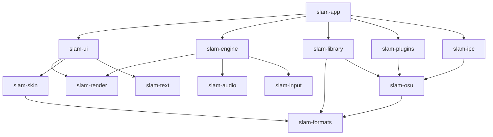

# SLAM — архитектура

**SLAM — Stable Lazer Always Mythical.** Самостоятельный кроссплатформенный клиент для режима osu!standard с открытым исходным кодом.

Документ описывает *что* и *почему* на уровне систем и их границ. Детали отдельных решений и их обоснование лежат в `docs/adr/` (ссылки вида [ADR-0003]). Если решение меняется, сначала пишется новый ADR, затем правится этот документ.

Как читать: целиком или по нужному разделу (оглавление ниже) вместе со связанными ADR.

## Оглавление

1. Цели и не-цели
2. Принципы
3. Обзор системы и крейты
4. Потоки, время и кадровый пайплайн
5. Рендер
6. Аудио
7. Геймплей (крейт `slam-osu`)
8. Форматы и совместимость
9. Библиотека и выбор песни
10. Скины
11. HUD
12. Интерфейс: темы и шрифты
13. Локализация
14. Плагины
15. Профили, настройки, экспорт и импорт
16. API для внешнего редактора
17. Данные на диске
18. Тестирование и бюджеты производительности
19. Платформы, сборка, лицензии
20. Открытые вопросы

---

## 1. Цели и не-цели

### Цели

- Задержка ввода и звука на уровне osu!stable или лучше; стабильный фреймтайм.
- Частота кадров и частота update-цикла настраиваются вплоть до 8000.
- Правила геймплея совпадают с osu!lazer: лазерные реплеи воспроизводятся 1:1 [ADR-0005].
- Самостоятельность: клиент полностью работает без установленных stable или lazer [ADR-0007].
- Опциональный импорт карт, скинов, коллекций и реплеев из stable и lazer.
- Скины stable и lazer, включая JSON-раскладки HUD лазера; сборка скина поэлементно из разных скинов [ADR-0008].
- Просмотр реплеев stable и lazer.
- Расширяемость: геймплейные моды (включая генеративные), UI-модули, коннекторы к серверам на Luau [ADR-0009].
- Минималистичный интерфейс без bloom и blur, с мягкими переходами; темы настраиваются пользователем.
- Локальные профили; экспорт и импорт всех настроек одним файлом [ADR-0013].

### Не-цели (сознательно не делаем)

- **Редактор карт внутри клиента.** Только API для внешнего редактора [ADR-0014].
- **Скачивание карт из клиента.** Никаких встроенных веб-интерфейсов для карт: пользователь сам качает `.osz` с сайта и открывает их в SLAM.
- **Подключение к Bancho** и отправка скоров на официальные серверы osu!. Это запрещено правилами osu!. Отправка на сторонние серверы — только через плагины-коннекторы, встроенных серверов нет.
- **Режимы taiko, catch, mania** [ADR-0006].
- **macOS на старте.** Архитектура рендера и аудио оставляет возможность добавить её позже.

## 2. Принципы

1. **Ядро без движка.** `slam-formats` и `slam-osu` не зависят от рендера, аудио, окна и ОС. Они детерминированы и полностью тестируются без графики.
2. **Ориентация на данные.** Плоские массивы и индексы вместо дерева объектов; никакого обхода графа сцены с инвалидациями каждый кадр.
3. **Ноль аллокаций в горячих путях:** update-тик, отрисовка кадра, аудиоколбэк. Проверяется тестами (счётчик аллокаций в debug-сборках).
4. **Тяжёлая работа — не в потоках кадра.** Диск, декодирование, расчёт звёзд, поиск, шейпинг текста выполняются в пуле рабочих потоков; результаты приходят готовыми.
5. **Детерминизм геймплея.** Одинаковые входные данные (карта, моды, сид, ввод) дают одинаковый результат на любой платформе.
6. **Лазер — справочник по правилам, а не по устройству движка.** Формулы и правила судейства портируются из лазера; потоки, рендер, лимитер, UI — собственные.
7. **Всё внешнее — опционально.** Импорт из других клиентов, плагины, коннекторы: без них клиент полностью работоспособен.
8. **Измеряем, а не предполагаем.** Решения о производительности принимаются по бенчмаркам; бюджеты проверяются в CI (раздел 18).

## 3. Обзор системы и крейты



| Крейт | Ответственность | Может зависеть от |
|---|---|---|
| `slam-formats` | Парсинг и запись: `.osu`, `.osr` (+ блок лазера, + контейнер SLAM), `osu!.db`, `collection.db`, `scores.db`, `skin.ini`, HUD JSON лазера, `.osz`/`.osk` | только чистые библиотеки (без I/O-фреймворков, без GPU) |
| `slam-osu` | Правила osu!standard: конвертация и обработка карты, геометрия слайдеров, хит-окна, политика попаданий, здоровье, скоринг, встроенные моды, интерфейс `GameplayMod`, симуляция реплея без графики | `slam-formats`, `rosu-pp` |
| `slam-input` | Окно и ввод (SDL3), таймстемпы событий, input-поток | — |
| `slam-render` | HAL рендера и бэкенды, батчер спрайтов, меши слайдеров, рендер-таргеты | — |
| `slam-text` | Реестр шрифтов, шейпинг, MSDF-атласы | `slam-render` |
| `slam-audio` | HAL аудио и бэкенды, микшер, декодирование, ресемплинг, time-stretch, аудиоклок | — |
| `slam-engine` | Потоки, клоки, кадровый пайплайн, лимитер, обмен снапшотами | `slam-input`, `slam-render`, `slam-audio` |
| `slam-skin` | Загрузка скинов, реестр элементов, слоистая сборка, фолбэки | `slam-formats` |
| `slam-library` | Хранилище, SQLite, снапшот, импорт, поиск и сортировка, кеш звёзд и миниатюр, профили | `slam-formats`, `slam-osu` |
| `slam-plugins` | Luau-рантайм, песочница, права, адаптеры хуков, API для скриптов, генерация типов и документации | `slam-osu` |
| `slam-ui` | Экраны, виджеты, HUD и его редактор, темы, анимации переходов | `slam-render`, `slam-skin`, `slam-text` |
| `slam-ipc` | JSON-RPC для внешнего редактора | `slam-osu` |
| `slam-app` | Точка входа, сборка всего вместе, настройки | всё |
| `slam-testkit` | Только тесты (`[dev-dependencies]`): счётчик аллокаций `assert_no_alloc` ([ADR-0016](adr/0016-testkit-alloc-counter.md)) | — |

Правила зависимостей проверяются в CI (например, через `cargo deny` или отдельный тест на граф зависимостей). Нарушение правил — ошибка сборки.

Дополнительно: `tools/lazer-export` — небольшая утилита на .NET для чтения `client.realm` лазера (раздел 8).

## 4. Потоки, время и кадровый пайплайн

Подробности и обоснование — [ADR-0002]; пробуждение update, тройной буфер и порядок событий — [ADR-0017](adr/0017-update-wakeup-and-snapshots.md).

### Потоки

| Поток | Что делает | Как просыпается |
|---|---|---|
| **Input** (главный поток ОС) | Забирает события ввода, ставит наносекундный таймстемп, кладёт в SPSC-кольцо (`rtrb`) | По событию ОС, без опроса |
| **Update** | Геймплей, судейство, HUD-данные, UI-логика; пишет снапшот для отрисовки | По событию ввода **и** с заданной частотой (до 8000 Гц) |
| **Draw** | Строит список отрисовки из последнего снапшота с интерполяцией, отправляет в GPU | Лимитер кадров (до 8000 FPS или без лимита) |
| **Audio** | Колбэк микшера: музыка, хитсаунды | Колбэк аудиоустройства |
| **Workers** (пул) | Диск, декодирование, звёзды, поиск, миниатюры, генеративные моды, MSDF | Очередь задач |
| **Scripts** | Тики UI-модулей (по умолчанию 60 Гц) | Таймер |
| **IO** | Коннекторы, IPC редактора | Асинхронно |

### Обмен данными

- Input → Update: SPSC-кольцо событий с таймстемпами. После каждого события кольцо будит update (`Notify`; на Linux — futex, на Windows — event + high-resolution waitable timer); между событиями update спит до дедлайна своей частоты, последние ~200 мкс — активное ожидание. Update получает события пачкой, отсортированной по таймстемпу; опоздавшее событие старше уже выданного получает время последнего выданного, так что порядок не убывает и между тиками.
- Update → Draw: свой тройной буфер снапшотов (`slam-engine::snapshot`, один атомик на обмен); отрисовка всегда берёт самый свежий и никогда не ждёт.
- Update → Audio: lock-free очередь команд («сыграть сэмпл», «seek», «громкость»); аудио → update: атомики с позицией воспроизведения.
- Workers → все: результаты через каналы; в кадр попадают только готовые данные.

### Время

- **Игровое время** — позиция аудио *на выходе устройства*: отправленные сэмплы минус задержка, которую сообщает аудио-API, экстраполированная высокоточным таймером и сглаженная. Плюс общий офсет и офсет карты.
- Попадания судятся по **таймстемпу события ввода**, переведённому в игровое время, а не по времени кадра. Точность не зависит от FPS.
- **Часы движка** — монотонные наносекунды `slam_engine::clock::now_ns()`: `CLOCK_MONOTONIC` на Linux, `QueryPerformanceCounter` на Windows. Ими пользуются лимитер, update и таймстемпы ввода.
- **Таймстемпы ввода.** SDL3 ставит событиям время в своей базе `SDL_GetTicksNS` (на Linux — `CLOCK_MONOTONIC_RAW` от момента инициализации SDL). На Wayland SDL берёт время события у композитора (высокоточное через `zwp_input_timestamps_v1`, если композитор его поддерживает) и переводит его в свою базу смещением, измеренным по первому событию и только уменьшаемым. Поэтому интервалы между событиями точные, но абсолютное значение несёт сдвиг на минимальную наблюдённую задержку доставки и не исправляет дрейф `MONOTONIC` относительно `MONOTONIC_RAW` (десятки ppm). `TickMapper` эту ошибку убрать не может: она уже внутри таймстемпа SDL. На X11 — момент чтения события SDL, на Windows — `GetMessageTime` (миллисекунды с гранулярностью системного тика, обычно ~15.6 мс; для судейства недостаточно, требуется доработка). `slam-input` переводит тики SDL в часы движка через смещение: чтение часов SDL зажимается между двумя чтениями часов движка (берётся самая узкая из трёх «вилок») и перемеряется раз в секунду, чтобы расхождение `MONOTONIC` и `MONOTONIC_RAW` (коррекция NTP) не накапливалось. Таймстемпы разных устройств могут приходить в кольцо не строго по возрастанию.

### Лимитер кадров

- Дедлайны абсолютные: дедлайн n-го кадра = `epoch + n·period` (без дрейфа, ошибка округления не накапливается). Пропуск дедлайна на целый период и больше перезапускает отсчёт от текущего момента, без догоняющих кадров.
- Сон: Windows — high-resolution waitable timer; Linux — `clock_nanosleep(CLOCK_MONOTONIC, TIMER_ABSTIME)`; последние ~200 мкс — активное ожидание.
- Режимы: без лимита; кратный частоте монитора; произвольный до 8000. Частоты draw и update игрок выбирает в настройках (пресеты 1000/2000/4000/8000 или своё значение от 1 до 8000 Гц) и меняет без перезапуска: движок передаёт новое значение потокам через атомики, update при этом будится сразу, draw применяет его со следующего кадра. По умолчанию update и draw — 1000 Гц.
- Present без ожидания: DXGI flip model с тирингом на Windows, IMMEDIATE в Vulkan, swap interval 0 в OpenGL.
- Встроенный оверлей: график фреймтайма, перцентили, частоты потоков. Для разработки — интеграция с Tracy.

## 5. Рендер

Подробности — [ADR-0003].

- Свой тонкий HAL с небольшой поверхностью: текстуры и атласы, батчер спрайтов, меши (тела слайдеров), рендер-таргеты, MSDF-текст, обрезка.
- Бэкенды по порядку: **OpenGL 3.3** (первый, работает везде, фолбэк) → **D3D11** (по умолчанию на Windows, если бенчмарк подтвердит) → **Vulkan** (опционально для Linux) → **Metal** (при возвращении macOS).
- Шейдеры пишутся один раз и транслируются через `naga` в GLSL, HLSL, SPIR-V и MSL.
- Тела слайдеров: меш строится один раз при загрузке, цвета трека и обводки — в шейдере, «змейка» — через обрезку пути.
- Загрузка текстур из рабочих потоков с бюджетом на кадр (по умолчанию ≤ 2 МБ/кадр).

## 6. Аудио

Подробности — [ADR-0004].

- Свой HAL с бэкендами:
  - **Windows / WASAPI**: shared; shared low-latency (`IAudioClient3`, минимальный период драйвера); **exclusive** (обход системного микшера). ASIO — опционально, позже.
  - **Linux**: PipeWire (квантум через `node.latency`, например `128/48000`); ALSA `hw:` как запасной вариант.
- Настройки: бэкенд, режим, устройство, размер буфера в сэмплах с подписью в мс, кнопка теста.
- Аудиопоток с повышенным приоритетом (MMCSS «Pro Audio» на Windows). В колбэке нет аллокаций, блокировок, системных вызовов.
- Хитсаунды декодируются заранее в PCM и пересэмплируются под частоту устройства.
- Музыка: декодирование (`symphonia`) в отдельном потоке в кольцевой буфер; ресемплинг (`rubato`); изменение скорости с сохранением питча — signalsmith-stretch (MIT).
- Клик → звук: update-поток засчитывает попадание и сразу кладёт команду в очередь аудио.

## 7. Геймплей (крейт `slam-osu`)

Подробности — [ADR-0005], [ADR-0010].

### Источник правил

Эталон — код osu!lazer (MIT): конвертация и обработка карты (стэкинг, тики, репиты, хвосты), геометрия путей слайдеров, хит-окна, политика попаданий, здоровье, standardised scoring. Портирование — по коду с указанием исходного файла в комментарии; уведомление MIT лазера хранится в `THIRD_PARTY_NOTICES`.

### Числа

Типы копируются из лазера буквально: время — `f64` мс, позиции — `f32`, тот же порядок операций в формулах. Замена типов «для точности» ломает совместимость реплеев.

### Режимы судейства

- `lazer` — по умолчанию, для игры и лазерных реплеев.
- `lazer + Classic` — для stable-реплеев (как это делает сам лазер).
- Точный профиль stable (ScoreV1 и все особенности) — возможное расширение, только если расхождения окажутся заметными.

### Моды

- Встроенные: NF, HD, TC, DT/NC/HT/DC и кастомная скорость (0.5–2.0, переключатель питча), DA (с расширенными диапазонами как в лазере), Mirror, Classic, а также остальные стандартные моды по мере необходимости.
- HD и TC — один слот с циклом: выкл → HD → TC → выкл.
- Модель данных мода совпадает с лазерной: акроним + словарь настроек. Встроенные моды используют акронимы лазера.
- Все моды, встроенные и скриптовые, реализуют один трейт `GameplayMod` (раздел 14).

### Симуляция без графики

`slam-osu` умеет прогнать реплей по карте и выдать статистику (количества попаданий, комбо, счёт, точность). Это основа корпусных тестов (раздел 18).

### pp и звёзды

`rosu-pp` (MIT), версия зафиксирована. Живой pp-каунтер — через пошаговый расчёт. Для сгенерированных карт звёзды и pp считаются по результату генерации.

## 8. Форматы и совместимость

| Что | Чтение | Запись | Примечания |
|---|---|---|---|
| `.osu` (версии формата 3–14+) | да | да | лазерный сдвиг 24 мс для старых версий формата |
| `.osz` | да | да (экспорт) | |
| `.osr` stable | да | да | |
| `.osr` + блок лазера | да | да | моды с настройками и статистика лазера |
| Контейнер реплея SLAM | да | да | для кастомных модов: ID, версия, хеш и настройки модов, сид, вложенная сгенерированная карта |
| `osu!.db`, `collection.db`, `scores.db` | да | нет | импорт из stable |
| `client.realm` лазера | через `tools/lazer-export` | нет | экспортёр на .NET выдаёт JSON-манифест; файлы подключаются хардлинками |
| `skin.ini` (все версии), `.osk` | да | да (экспорт) | |
| HUD JSON лазера | да | нет | таблица соответствия «тип компонента лазера → компонент SLAM» |

Импорт из других клиентов — одноразовая операция или «связанная библиотека» (папка stable читается на месте). Если связанная папка исчезла, карты помечаются как недоступные; ничего не ломается.

Автопоиск установок: Windows — стандартные пути stable и lazer; Linux — lazer в `~/.local/share/osu`, stable внутри Wine-префиксов.

## 9. Библиотека и выбор песни

Подробности — [ADR-0007].

### Хранилище

- Файлы карт — по SHA-256 в `library/files/ab/cd/<hash>`; без дубликатов.
- `library.sqlite` — источник истины (WAL). UI **никогда** не обращается к SQLite напрямую: только поток библиотеки.
- `library.bin` — снапшот для меню в формате zero-copy (`rkyv`), открывается через mmap за миллисекунды. Хранит данные по колонкам (struct of arrays): ID, звёзды, BPM, длина, CS/AR/OD/HP, нормализованные строки для поиска, ссылки на миниатюры. Пересобирается в фоне после изменений.

### Наполнение

- Открытие или перетаскивание `.osz` (ассоциации файлов регистрируются при установке).
- Опциональный мастер импорта из stable и lazer при первом запуске и в настройках.
- Режим рабочей папки для внешних редакторов (раздел 16).

### Выбор песни без лагов

- Поиск, фильтры (язык запросов как в stable: `stars>5 ar<9 creator=...`) и сортировки выполняются в рабочем потоке по колонкам снапшота; результат — массив индексов. Новый ввод отменяет предыдущий запрос.
- Перестановки для популярных сортировок посчитаны заранее.
- Карусель виртуализирована: строки одинаковой высоты, рисуются только видимые (~20). Объектов на каждую карту нет.
- Фоны: миниатюры ~256 px создаются при импорте; декодирование в пуле; загрузка в GPU с бюджетом на кадр; LRU-кеш текстур; полноразмерный фон — после остановки прокрутки (~100 мс).
- Звёзды без модов считаются при импорте; с модами — в фоне с отменой, кеш по ключу (хеш карты, моды и их настройки, версия `rosu-pp`). Пока значения нет, показывается nomod-значение с индикатором.
- Превью музыки с `PreviewTime` и задержкой ~150 мс.
- Инкрементальный скан связанной папки stable по времени изменения и размеру.

### Коллекции

Свои коллекции; импорт из `collection.db` stable и из лазера.

## 10. Скины

Подробности — [ADR-0008].

- Форматы: stable (`skin.ini` всех версий, `@2x`, анимационные кадры) и lazer (тот же формат + JSON-раскладки HUD).
- Скины хранятся **обычными папками** и редактируются на месте; изменения подхватываются на лету.
- Дефолтный скин — классический скин osu! из osu-resources, в `assets/default-skin/` под лицензией CC-BY-NC 4.0 с атрибуцией. Шрифты с отдельными лицензиями заменены на OFL-аналоги.

### Реестр элементов

Каждый скинуемый элемент описан в реестре: ID, категория, файлы (включая кадры анимации и `@2x`), связанные ключи `skin.ini`. Пример: элемент «хиткруг» = `hitcircle`, `hitcircleoverlay` + `HitCircleOverlayAboveNumber`; «цифры комбо» = `default-0…9` + `HitCirclePrefix`, `HitCircleOverlap`; «курсор» = `cursor`, `cursormiddle`, `cursortrail`, `cursor-smoke` + `CursorRotate`, `CursorExpand`, `CursorCentre`, `CursorTrailRotate`. Хитсаунды тоже элементы.

### Слоистая сборка (профиль скина)

Профиль скина = базовый скин + правила «элемент → источник» (другой скин или свой файл), хранится в JSON. Исходные скины не меняются. Элемент интерпретируется по правилам версии **своего** скина-источника. Меню сборки строится из реестра: категории → элементы с превью → выбор источника.

## 11. HUD

Подробности — [ADR-0015].

### Компоненты (по одному на каждый вид, стиль — настройка)

Счёт, точность, комбо (цифры скина или шрифт); здоровье; прогресс песни; индикатор ошибок попадания (полоса или цвета); pp-каунтер; unstable rate; счётчик клавиш; клики в секунду; счётчик попаданий; отображение модов; лидерборд в игре (локальный или из коннектора); **текст с шаблоном** (`{stars:.2}★ · {bpm} BPM · AR{ar}`) — заменяет старрейт, атрибуты карты, имя игрока и произвольный текст.

### Редактор раскладки

Перетаскивание; 9 точек привязки и origin; масштаб, поворот, прозрачность; панель свойств компонента (шрифт, цвет, размер, параметры). Превью поверх автоплея или паузы реального реплея. Раскладка сохраняется в JSON; лазерные раскладки импортируются. Компоненты из UI-модулей размещаются тем же редактором.

## 12. Интерфейс: темы и шрифты

### Темы

Тема интерфейса отделена от скина геймплея: папка с `theme.toml` и ассетами.

- Токены: цвета, скругления, отступы, шрифты, длительности и кривые анимаций.
- Видимость блоков на каждом экране.
- Слоты для своих спрайтов: фон меню, логотип, иконки, рамки панелей.
- Горячая перезагрузка. Отдельное меню в настройках редактирует тот же файл.
- Один встроенный минималистичный шаблон. Без bloom, blur и параллакса; переходы — fade/slide 150–250 мс с ease-out.

### Шрифты

- В комплекте — OFL-шрифты (кандидаты: Nunito Sans / Outfit / Manrope для текста, Exo 2 для заголовков; выбор — по результатам примерки).
- Фолбэк для CJK — системные шрифты (поиск через `fontdb`); Noto CJK — опциональный пакет.
- Пользовательские шрифты: TTF/OTF/WOFF2, включая вариативные; папка `fonts/`, выбор в настройках; скины и темы могут приносить свои.
- Общий реестр семейств; любой компонент ссылается на семейство по имени.
- Шейпинг через `cosmic-text`/`rustybuzz`; глифы в MSDF-атлас по требованию в рабочем потоке, кеш на диске.

## 13. Локализация

Подробности — [ADR-0011].

- Формат Fluent (`.ftl`): множественные формы описываются в самом переводе.
- Языковой пакет `.slamlang` = архив с `manifest.toml` (код языка, название, авторы, совместимая версия SLAM) и `.ftl`-файлами.
- Недостающие ключи — из английского. Горячая перезагрузка.
- Плагины приносят свои `.ftl` в собственном пространстве имён.
- `slam i18n check` — отчёт о недостающих и устаревших ключах; запускается в CI для встроенных языков (минимум en, ru).

## 14. Плагины

Подробности — [ADR-0009].

### Рантайм

Luau через `mlua` (фича `luau`). Каждый плагин — в своей VM: режим песочницы, лимит памяти, лимит инструкций через колбэк прерывания.

### Пакет

Один `.luau`-файл или архив `.slammod`. Манифест `slam-plugin.toml`: `id` (обратный домен), `name` (ключ локализации), `version` (semver), `api` (диапазон версий API), `kinds`, `[permissions]` (`network` — список доменов, `read` — `scores`/`replays`/`library`, `storage`), `[i18n]`. Права подтверждаются пользователем при установке и повторно при их расширении.

### Типы плагинов и где они исполняются

| Тип | Поток | Бюджет |
|---|---|---|
| `gameplay_mod` | загрузка карты — рабочий поток; игра — update | строгий; превышение или ошибка прерывает попытку |
| `ui_module` | поток скриптов, свои тики (по умолчанию 60 Гц) | превышение → снижение частоты → отключение; ошибка → заглушка |
| `connector` | IO, асинхронно (корутины Luau) | таймауты |

### Хуки `gameplay_mod`

| Хук | Когда | Что может |
|---|---|---|
| `on_beatmap_load` | при загрузке, рабочий поток | **полный контроль над картой**: позиции, параметры, тайминги, добавление и удаление объектов, хитсаунды новых объектов. Аудио — нет |
| `rate` | один раз | скорость и сохранение питча |
| `on_object_spawn` | появление объекта | декларативные анимации (основной путь для HD, TC, Grow) |
| `on_frame` | update-тик, с бюджетом | рисование в оверлей (Flashlight-подобные) |
| `transform_input` | каждое событие ввода | изменение ввода; скор помечается как изменённый |
| `on_judgement` | после попадания | здоровье, провал, рестарт |
| флаги | статически | `prevent_fail`, несовместимые моды, множитель |

Детерминизм: нет системного времени, файлов и сети; `math.random` заменён на `slam.random` с сидом из реплея.

Генеративные моды: результат `on_beatmap_load` проходит валидацию хоста (сортировка времени, границы поля, корректность путей, отсутствие NaN, наличие тайминг-поинтов, лимит количества объектов). Звёзды и pp считаются по сгенерированной карте; кеш по ключу (карта, хеш мода, настройки, сид). Сгенерированная карта вкладывается в контейнер реплея SLAM.

Ядро:

```rust
pub trait GameplayMod {
    fn on_beatmap_load(&mut self, map: &mut BeatmapEdit) {}
    fn rate(&self) -> Option<RateChange> { None }
    fn on_object_spawn(&mut self, obj: &HitObject, out: &mut AnimList) {}
    fn on_frame(&mut self, state: &PlayState, overlay: &mut DrawList) {}
    fn transform_input(&mut self, ev: &mut InputEvent) {}
    fn on_judgement(&mut self, j: &Judgement, ctl: &mut PlayControl) {}
    fn flags(&self) -> ModFlags { ModFlags::default() }
}
```

Встроенные моды реализуют трейт нативно; Luau-адаптер реализует тот же трейт.

### `ui_module`

- Виджеты для HUD (размещаются редактором раскладки) и слотов меню (выбор песни, результаты, главное меню).
- Данные — подписки только на чтение, каждая под правом: `gameplay.score`, `gameplay.hit_events`, `beatmap.current`, `beatmap.attributes`, `library.selection`, `scores.local`, `connector.leaderboard`.
- Отрисовка — ограниченный набор примитивов (прямоугольники со скруглением, текст, спрайты, линии, обрезка), токены темы. Своих шейдеров нет.
- Ввод — только клики в меню над виджетом; в геймплее ввода нет.

### `connector`

- `authenticate` — OAuth PKCE проводит хост; токен хранится в хранилище ОС (`keyring`); **плагин токен не видит**, хост подставляет его в запросы к доменам из манифеста.
- `submit_score(score, replay)` — очередь, повторы и работу без сети обеспечивает хост (очередь в SQLite).
- `fetch_leaderboard(beatmap_hash, filters)` → данные для лидерборд-виджета.
- HTTP — только через `slam.http` и только к доменам из манифеста; только HTTPS (кроме localhost). По умолчанию всё выключено; встроенных серверов нет.
- Античит на стороне клиента невозможен (открытый код, скриптовые моды). В отправку включаются список плагинов с хешами и реплей; доверие к скору — решение сервера.

### Инструменты для моддеров

API описывается в Rust с doc-комментариями; генератор выдаёт файлы типов для luau-lsp, сайт документации (mdBook) и журнал изменений API. Плюс: репозиторий примеров, `slam mod new`, горячая перезагрузка в режиме разработчика, внутриигровая консоль со стектрейсами, профайлер времени хуков.

### Версионирование

Semver; устаревшие функции работают одну мажорную версию с предупреждением; хост может держать прослойки совместимости.

## 15. Профили, настройки, экспорт и импорт

Подробности — [ADR-0013].

- **Локальные профили**: несколько игроков на одном компьютере, у каждого свои скоры, реплеи, настройки, профили скинов, раскладки.
- **Экспорт контента**: карты → `.osz`, скины → `.osk`, реплеи → `.osr` (или контейнер SLAM).
- **Файл настроек `.slamcfg`** — чтобы поделиться настройками с другом:
  - архив с `manifest.toml` (версия схемы, версия SLAM, список разделов);
  - разделы на выбор при экспорте: игровые настройки, клавиши, профиль скина (ссылками или со вложенными файлами скинов), раскладки HUD, тема (с ассетами), шрифты (с предупреждением о лицензиях), список плагинов с версиями (по желанию — сами плагины), язык;
  - **никогда не экспортируются**: токены и секреты; по умолчанию не экспортируются машинно-зависимые настройки (аудиоустройство, монитор, пути к библиотекам) — их можно включить вручную;
  - при импорте: превью изменений, выбор разделов, отчёт о недостающих скинах и плагинах, миграция схемы старых версий;
  - импорт плагинов из файла проходит то же подтверждение прав, что и обычная установка.
- **Резервная копия профиля** — отдельно от `.slamcfg`: всё, включая скоры и реплеи.

## 16. API для внешнего редактора

Подробности — [ADR-0014].

- **Библиотеки**: `slam-formats`, `slam-osu`, `slam-skin` публикуются на crates.io с документацией и стабильными версиями.
- **Связь с запущенной игрой**: JSON-RPC через named pipe (Windows) / unix-сокет (Linux), версионируемый протокол, токен доступа, только локально.
  - `play_test(map, start_time, mods)`, `reload_map(map)`, `seek`, `pause`, `autoplay`;
  - события в редактор: попадания, ошибки по времени, промахи;
  - `library.add_or_update(set)`.
- **Режим рабочей папки**: игра следит за указанной папкой и подхватывает изменения `.osu` на лету — для существующих редакторов.

## 17. Данные на диске

Корень: Windows — `%APPDATA%\SLAM`; Linux — `$XDG_DATA_HOME/slam` (данные) и `$XDG_CONFIG_HOME/slam` (настройки). Портативный режим — файл `portable` рядом с исполняемым файлом.

```
slam.toml                  общие настройки
profiles/<id>/             настройки, скоры, профили скинов, раскладки профиля
library/
  files/ab/cd/<sha256>
  library.sqlite
  library.bin
skins/<имя>/               обычные папки
themes/  fonts/  locales/  plugins/
replays/
cache/                     миниатюры, MSDF, звёзды с модами
logs/
```

## 18. Тестирование и бюджеты производительности

### Корпусы реплеев (главный критерий корректности ядра)

- **Корпус lazer**: реплеи с записанной лазером статистикой. Симуляция `slam-osu` должна совпадать 1:1 (количества попаданий, комбо, счёт).
- **Корпус stable**: реплеи stable, судейство `lazer + Classic`, сравнение с допуском.
- Корпусы хранятся вне основного репозитория (Git LFS или отдельный репозиторий); в CI — выборка, ночью — полный прогон.

### Прочее

- Юнит-тесты парсеров на реальных файлах (включая битые и старые версии форматов).
- Property-тесты для геометрии слайдеров и валидации генеративных карт.
- Тест «ноль аллокаций» для update-тика, отрисовки и аудиоколбэка: `slam-testkit::assert_no_alloc`, подсчёт по потоку ([ADR-0016](adr/0016-testkit-alloc-counter.md)).
- `cargo clippy -D warnings`, `cargo fmt --check`, `cargo deny` (лицензии: запрет GPL-зависимостей; уязвимости).
- Бенчмарки (`criterion`) с порогами регрессий.

### Бюджеты (стартовые, уточняются после M0)

| Метрика | Цель |
|---|---|
| Пустой кадр + 500 спрайтов | ≥ 8000 FPS на среднем железе |
| Джиттер лимитера | p99 отклонения < 50 мкс |
| Клик → постановка хитсаунда в очередь | < 100 мкс |
| Выходная задержка аудио (WASAPI exclusive) | ≤ 5 мс |
| Загрузка снапшота библиотеки 100k сложностей | < 50 мс |
| Прокрутка выбора песни 100k | p99 фреймтайма не хуже, чем в геймплее |
| Поиск по 100k | < 10 мс |
| Холодный старт до главного меню | < 1 с (без первичного импорта) |

## 19. Платформы, сборка, лицензии

- **Платформы**: Windows 10+ x64, Linux x64 (X11 и Wayland). macOS — позже (Metal-бэкенд, CoreAudio).
- **Сборка**: Rust stable (версия закреплена в `rust-toolchain.toml`); C++-компилятор для Luau (MSVC на Windows, gcc/clang на Linux).
- **SDL3** (`sdl3-sys`): на Linux собирается из исходников и линкуется статически (нужен CMake). X11 и Wayland подгружаются во время работы, но поддержка попадает в сборку, только если при сборке есть их заголовки (`libx11-dev`, `libwayland-dev`, `libxkbcommon-dev` и т. п.); без них SDL молча собирается только с `offscreen`/`dummy`. На Windows используется SDL3 из системы (pkg-config).
- **Упаковка**: Windows — установщик + портативный архив; Linux — AppImage (Flatpak позже: его песочница мешает импорту из других клиентов).
- **Лицензии** [ADR-0012]: код — `MIT OR Apache-2.0`; дефолтный скин — CC-BY-NC 4.0 (osu-resources), отдельная папка с атрибуцией; коммерческим форкам нужно заменить скин. Портированный код лазера — с уведомлением MIT в `THIRD_PARTY_NOTICES`. GPL-зависимости запрещены. Название не использует бренд «osu!».

## 20. Открытые вопросы

- Выбор основного бэкенда рендера на Windows и Linux — по бенчмарку M0.
- Точный набор встроенных модов помимо перечисленных.
- Нужен ли точный профиль судейства stable — по результатам корпуса stable на M6.
- Конкретные OFL-шрифты — после примерки в интерфейсе.
- Детальный дизайн экранов: главное меню, выбор песни, результаты, настройки.
- Лицензия ASIO SDK — если дойдём до ASIO.
- Каталог плагинов (индекс в отдельном репозитории): нужен ли и когда.
